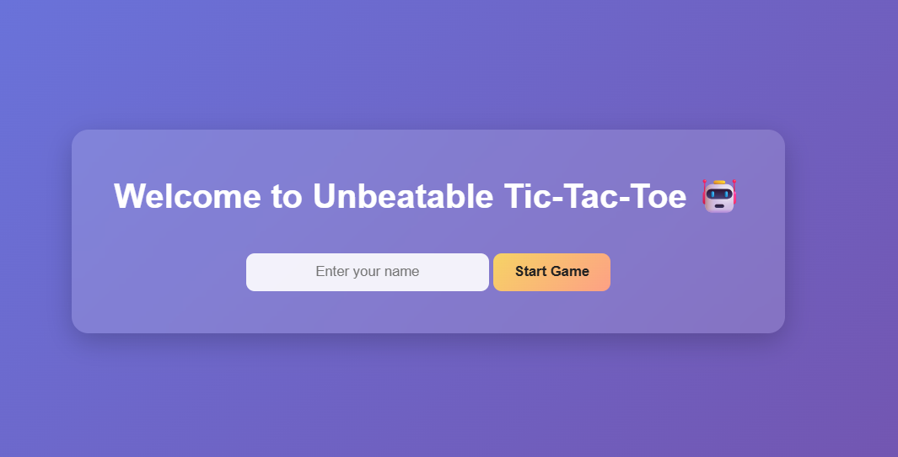
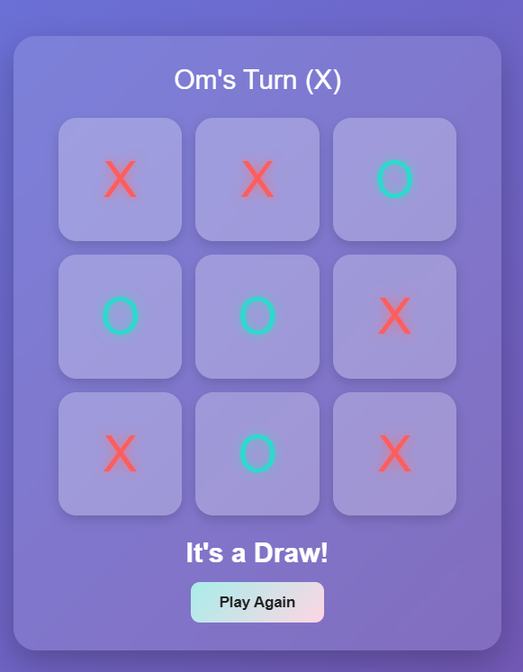
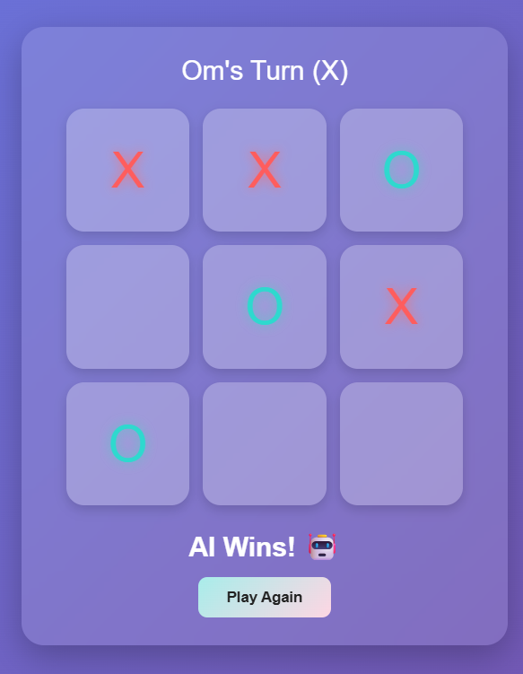

# TicTacToe-AI 🎮 (Unbeatable AI using Minimax + Alpha–Beta Pruning)

This project is a web-based Tic Tac Toe game where the player competes against an **unbeatable AI**.  
The AI uses the **Minimax algorithm** enhanced with **Alpha–Beta pruning**, ensuring perfect and instant decision-making every time.

The backend is built using **Flask (Python)**, and the frontend uses **HTML, CSS, and JavaScript**.

---

## 🚀 Preview Screenshot  


<p align="center">
  <br>
  <br>
  <br>
</p>

---


## ✨ Features

- 🎯 AI that cannot be defeated  
- 🧠 Minimax Algorithm for optimal gameplay  
- ⚡ Alpha–Beta Pruning for faster decisions  
- 📡 Flask backend API for handling moves  
- 🧩 Real-time interaction between user & AI  
- 🎨 Clean and responsive interface  
- 📁 Organized folder structure  

---

## 🧠 AI Logic Explained

The AI checks every possible move using **Minimax**:

- **AI wins (O)** → Score = `+10`  
- **Player wins (X)** → Score = `-10`  
- **Draw** → Score = `0`

Alpha–Beta pruning reduces unnecessary evaluations, making the AI’s responses instant while staying optimal.


---

## 🔧 How to Clone & Run This Project

### 1️⃣ Clone the Repository

```bash
git clone https://github.com/Ompatil9021/TicTacToe-AI.git
```


### 2️⃣ Go into the Project Folder

```bash
cd TicTacToe-AI
```

### 2️⃣ Type to update flask

```bash
pip install flask
```


### 3️⃣ Type to run Server

```bash
python app.py
```

### 4️⃣ Open the Game in Browser

```bash
http://127.0.0.1:5000/
```

